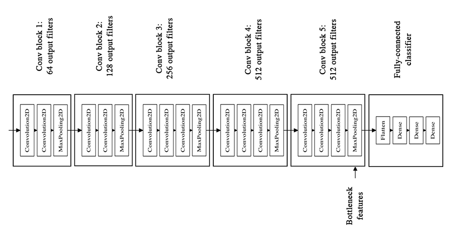
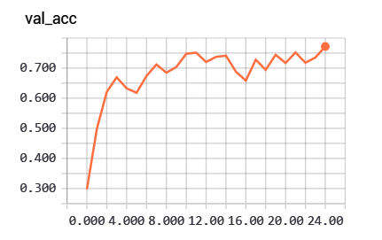
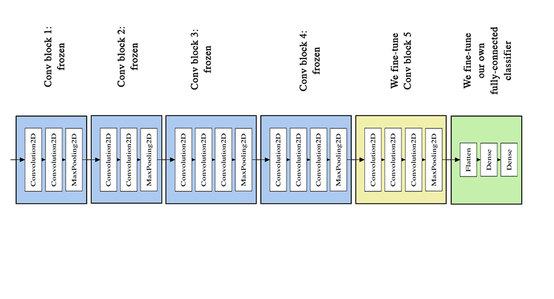
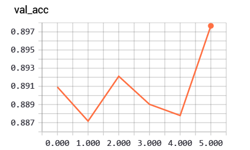

# Oxford Flowers

to-do:

- [x] get the bottle-neck feature of model and train the top model
- [x] fine-tune the model with the help of top moel weights
- [ ] analyse the results 

### Dependencies 

- numpy 
- TensorFlow 
- keras
- h5py
- scipy

### How to use

1.  get bottle-neck feature

   the datasets of this project are not enough for a  complicated network, so we uses a trained network in other datesets to obtain the bottleneck feature of images. meanwhile, some data augmentation method have been used to make more samples, such as  rotate, zoom, flip and so on. The graph shown as below is a VGG16 network. The bottleneck feature is the output of the last conv block.

   

2. train the top layers

   The dimension of bottleneck feature is much less than the raw data. We enter it into a network called top layers with fully connected layer to get the class of every sample. After 24 epoches, the validation accuracy is up t0 77.21%.

   

3. fine-tune pre-trained network 

   Because the pre-trained network we used to generate the bottleneck feature was not trained for our datasets, we can tune the weights of high layers to get more accurate results.

   We first load the weights of pretrain network and the top layers, and set the first 25 layers to be non-trainable. And, we fit the whole network with small learning rate. After 5 epoches, the validation accuracy is up t0 89.77%. I think if I have more time to fit the network, the accuracy can be higher.

   

